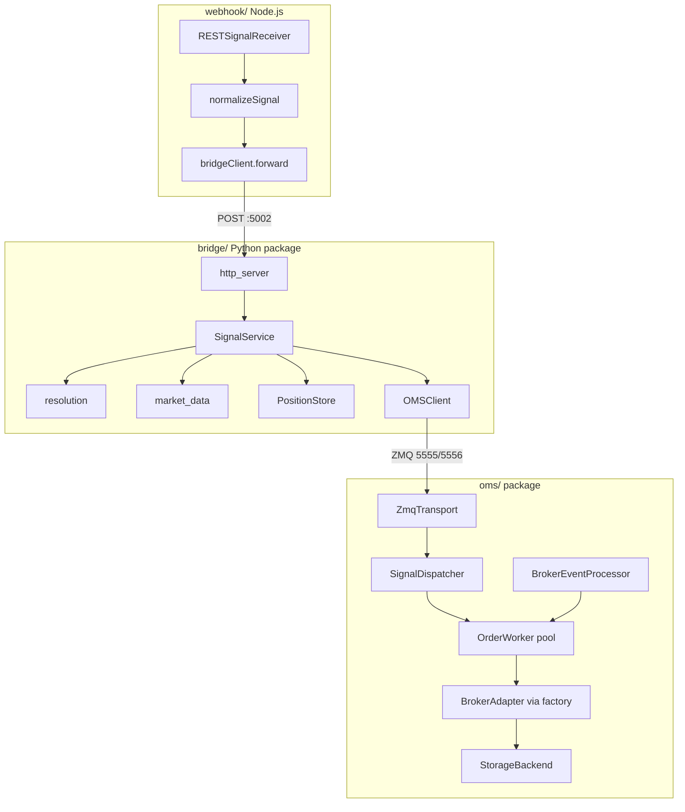

# Trading Middleware Refactor

## Guiding constraints
- **Behavior must not change.** Same CLI entry points (`python oms_server.py`, `python nifty_signal_bridge.py`, `cd webhook && npm start`), same HTTP endpoints, same ZMQ message contract, same JSON file schemas (`positions.json`, `history.json`, `alerts.json`, `data/*`).
- **Safety-net-first.** Add characterization tests before touching logic; run them after every phase.
- Do not commit unless asked. Refactor in place on the current branch.

## Target architecture

## Phase 0 — Safety net, secrets, dead-code hygiene
- Add characterization tests (pytest) that pin current behavior of pure/high-value logic BEFORE refactoring:
  - Bridge resolution: `parse_tv_option_ticker`, `tv_to_xts_description`, `is_monthly_expiry`, `resolve_contract_by_ticker` (fixture CSV), `get_position_display_values` (extend `[tests/test_resolver.py](tests/test_resolver.py)`, `[tests/test_position_display.py](tests/test_position_display.py)`).
  - OMS: introduce a `FakeBroker(AbstractBrokerAdapter)` and test `OrderManager` place/cancel/modify/squareoff + `inject_broker_event` fill flow without network/ZMQ where feasible.
- Move secrets to env: add `python-dotenv` loading; read `broker.app_key/secret_key/client_id` and the XTS market-data credentials in `[nifty_atm_ltp.py](nifty_atm_ltp.py)` / `[get_masters_data.py](get_masters_data.py)` from env. Add `.env.example` and scrub literals from `[config.yaml](config.yaml)` (use `${VAR}` interpolation in `[oms/config.py](oms/config.py)`).
- Remove dead code: commented `tv_to_xts`/Thursday-expiry blocks and duplicate imports in `[nifty_signal_bridge.py](nifty_signal_bridge.py)`; commented test matrix in `[tests/test_resolver.py](tests/test_resolver.py)`; unused `asdict`/`datetime` imports and duplicate `XTS_STATUS_MAP` in `[oms/models/order.py](oms/models/order.py)`; unused `XTS_MARKETDATA_URL`; dead `getLogs()` in webhook.

## Phase 1 — Shared foundation (kill duplication)
- Consolidate cross-file boilerplate into shared helpers:
  - IST/`now_iso` → everyone uses `[oms/utils/timeutil.py](oms/utils/timeutil.py)` (remove local `get_ist_now` copies in `[nifty_signal_bridge.py](nifty_signal_bridge.py)` and `[strategy_client.py](strategy_client.py)`).
  - Win32 selector-loop bootstrap → one `oms/utils/runtime.py` helper used by all four entry points.
  - Single canonical `XTS_STATUS_MAP` in `[oms/models/order.py](oms/models/order.py)`; `[oms/broker/xts_adapter.py](oms/broker/xts_adapter.py)` imports it.
  - Shared XTS credentials/config object consumed by market-data scripts.

## Phase 2 — OMS package refactor (design patterns)
- Split the `OrderManager` god-class in `[oms/core/order_manager.py](oms/core/order_manager.py)` into collaborators, keeping `OrderManager` as a thin **Facade**:
  - `ZmqTransport` (receive/publish), `SignalDispatcher` (**Command** map `msg_type`→handler), `OrderWorker` pool (producer/consumer), `BrokerEventProcessor` (fill/qty normalization shared with adapter), `OrderBookSync`.
- Complete the broker **Adapter** interface in `[oms/broker/base.py](oms/broker/base.py)`: add `cancel_all_orders`, `squareoff_position`, and a `BrokerEventParser` **Protocol**; inject the parser into `BrokerEventProcessor` instead of hardcoding `XTSBrokerAdapter.parse_order_event`.
- Add a broker **Factory** keyed on `config.broker.type` (wired from `[oms_server.py](oms_server.py)`).
- Typed domain models: enforce enums on `Order` fields, add `Order.from_dict`; type `OrderResponse.msg_type`. 
- Storage: `StorageBackend` **Protocol** (**Repository/Strategy**) with the current file impl in `[oms/storage/file_store.py](oms/storage/file_store.py)`; wrap blocking I/O in `asyncio.to_thread`. Add a `Position` dataclass with `apply_fill` in `[oms/core/position_tracker.py](oms/core/position_tracker.py)`.

## Phase 3 — Bridge + client scripts decomposition
- Break `[nifty_signal_bridge.py](nifty_signal_bridge.py)` (~1500 lines) into a `bridge/` package; keep `nifty_signal_bridge.py` as a thin entrypoint:
  - `bridge/resolution.py` (ticker parsing, tv→xts, multi-exchange resolver, cached master loader — **Strategy** per resolution mode).
  - `bridge/positions.py` (`PositionStore` **Repository** for positions/history/alerts JSON).
  - `bridge/market_data.py` (LTP fetch + position hydration).
  - `bridge/signal_service.py` (`handle_signal` orchestration; **Command** objects for BUY / SELL / FLAT / manual square-off).
  - `bridge/http_server.py` (route table + a JSON/CORS response helper to remove the repeated `send_response`/header boilerplate).
- Move helpers into packages sharing one XTS market-data client + `ContractLoader`: `market_data/` (from `[nifty_atm_ltp.py](nifty_atm_ltp.py)` + `[get_masters_data.py](get_masters_data.py)`) and `clients/` (from `[strategy_client.py](strategy_client.py)`), fixing the docstring/return-value drift in `OMSClient`.
- Relocate `[test_multi_exchange_resolution.py](test_multi_exchange_resolution.py)` into `tests/` or `scripts/`.

## Phase 4 — Node.js webhook + dashboard
- Extract `normalizeSignal(body)` (shared validation/normalization) and a promise/`fetch`-based `bridgeClient` (replace nested-callback `forwardSignal`) in `[webhook/index.js](webhook/index.js)` / `[webhook/RESTSignalReceiver.js](webhook/RESTSignalReceiver.js)`.
- Config-drive bridge host/port and dashboard `API_BASE`; add `.env.example`. Fix `SignalSource` JSDoc drift in `[webhook/SignalSource.js](webhook/SignalSource.js)`. Split `[webhook/public/index.html](webhook/public/index.html)` into HTML + `app.js` + `styles.css`. Remove `console.log(req.body)`.

## Phase 5 — Documentation
- Add docstrings (module/class/function) across all refactored Python + JSDoc for JS.
- Create `docs/`: `architecture.md`, `oms.md`, `bridge.md`, `webhook.md`, `configuration.md`, `message-formats.md` (with mermaid diagrams), and update `[README.md](README.md)` (fix the dashboard-routes-through-Node inaccuracy). Add `webhook/README.md`.

## Verification after each phase
- `pytest` green; manual smoke: start OMS + bridge + webhook, submit the README test signals, confirm identical responses, position/history/alert files, and ZMQ payloads.