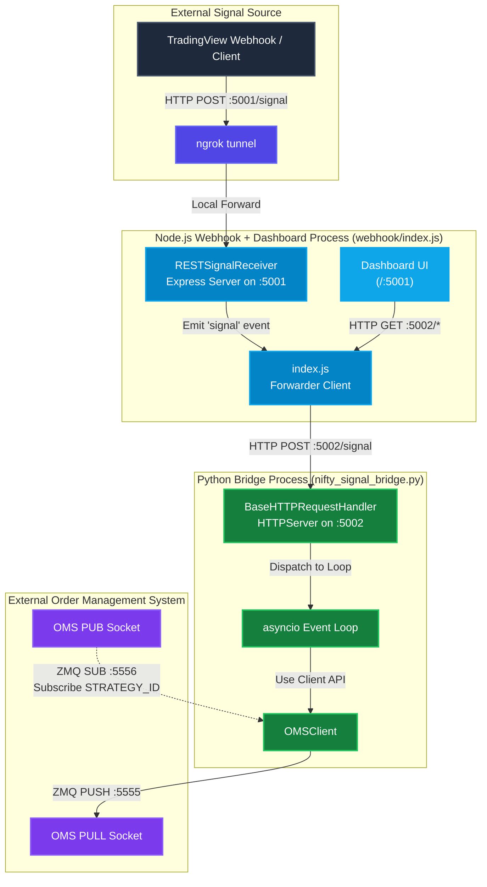
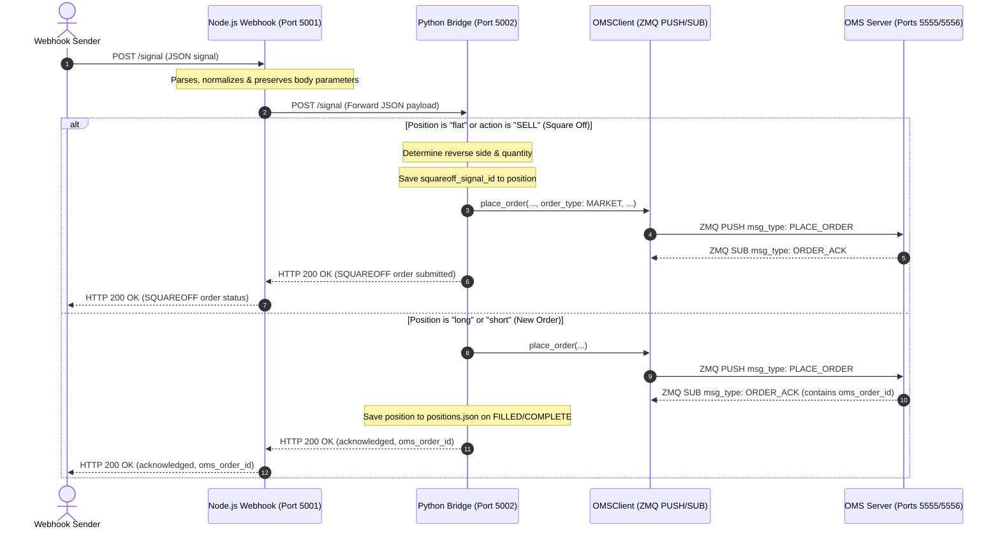

# OMS Webhook Integration System

This repository provides a complete, end-to-end asynchronous signal-to-order execution framework with a web-based dashboard for monitoring positions, alerts, and history. It integrates a **Node.js Webhook Receiver** (exposed via ngrok) with a **ZeroMQ-based Order Management System (OMS)** using a lightweight, native **Python HTTP Bridge**.

---

## Table of Contents
1. [System Architecture](#system-architecture)
2. [Flowcharts & Diagrams](#flowcharts--diagrams)
   - [System Architecture Topology](#system-architecture-topology)
   - [Order Execution Sequence Diagram](#order-execution-sequence-diagram)
3. [Component Breakdown](#component-breakdown)
   - [1. Node.js Webhook & Dashboard (`webhook/`)](#1-nodejs-webhook--dashboard-webhook)
   - [2. Python HTTP Bridge / Nifty Signal Bridge (`nifty_signal_bridge.py`)](#2-python-http-bridge--nifty-signal-bridge-nifty_signal_bridgepy)
   - [3. Strategy Client (`strategy_client.py`)](#3-strategy-client-strategy_clientpy)
4. [ZeroMQ & HTTP Message Formats](#zeromq--http-message-formats)
5. [HTTP API Endpoints](#http-api-endpoints)
6. [Getting Started & Configuration](#getting-started--configuration)
   - [Prerequisites](#prerequisites)
   - [Running the Services](#running-the-services)
   - [Dashboard Access](#dashboard-access)
   - [Verification & Testing](#verification--testing)

---

## System Architecture

The integration system processes incoming REST signals (e.g., from TradingView or an external algorithm), submits corresponding order requests to a high-speed ZeroMQ-based OMS, and provides a web-based dashboard for monitoring and manual control.

*   **Ingress & Dashboard (Node.js)**: A lightweight Express server in Node.js listens on port `5001` for trade signals. It also serves a static dashboard at the root URL (`http://localhost:5001`). The server normalizes parameters, preserves custom properties, and forwards signals to the bridge.
*   **Bridge (Python)**: A lightweight Python script (`nifty_signal_bridge.py`) hosts a local HTTP server on port `5002` using standard libraries. If the incoming webhook payload includes `ticker` or `symbol`, the bridge resolves the exact contract from `master_data/NSEFO.csv`, fetches its live LTP, and uses that to create the OMS request. Otherwise it defaults to resolving the current NIFTY ATM option using live ATM data. The bridge also tracks open positions, alerts, and history.
*   **OMS client (Python)**: The Python bridge uses the `OMSClient` class (built on `pyzmq`) to push orders to the OMS server (`tcp://127.0.0.1:5555`) and subscribe to response updates (`tcp://127.0.0.1:5556`).
*   **Position Management**: The bridge maintains open positions in `positions.json` and closed/failed positions in `history.json`.
*   **Square-off Logic**: Both automated (via "SELL" action or "flat" position) and manual (via dashboard) square-offs send a reverse MARKET order instead of a SQUAREOFF message.

---

## Flowcharts & Diagrams

### System Architecture Topology

This flowchart illustrates the path of a trade signal from the internet through the webhook, the bridge, and the client, to the OMS, and the dashboard:



### Order Execution Sequence Diagram

This sequence diagram details the chronological execution flow, showing how both new orders and square-offs are processed:



---

## Component Breakdown

### 1. Node.js Webhook & Dashboard (`webhook/`)
A lightweight Node.js/Express application that listens on port `5001` and serves a web dashboard.
*   **`RESTSignalReceiver.js`**: Exposes the `/signal` POST route. It extracts and normalizes core parameters while preserving vendor-specific custom properties.
*   **`index.js`**: Forwards signals to the Python bridge and serves static dashboard files from `webhook/public/`.
*   **`public/index.html`**: Interactive web dashboard with three tabs:
    - **Open Positions**: Displays currently active positions with manual square-off buttons
    - **Alerts**: Shows recent activity and notifications
    - **History**: Lists closed/failed positions with timestamps and statuses

### 2. Python HTTP Bridge / Nifty Signal Bridge (`nifty_signal_bridge.py`)
A background service written in Python that handles signal processing, position management, and serves API endpoints for the dashboard:
*   Resolves the current NIFTY ATM option contract or ticker-specific contract (using `master_data/NSEFO.csv`).
*   Tracks open positions in `positions.json` and closed/failed positions in `history.json`.
*   Runs an HTTP server on port `5002` with multiple API endpoints (see [HTTP API Endpoints](#http-api-endpoints)).
*   Integrates with `OMSClient` to send `PLACE_ORDER` messages (both for new orders and square-offs).
*   Implements a periodic cleanup thread that moves failed/rejected/cancelled/expired positions to history every 5 seconds.
*   Maintains an alerts list for recent activity notifications.

**Usage**:
```bash
python nifty_signal_bridge.py --port 5002
```

**Test Signal**:
```bash
curl -X POST http://localhost:5002/signal \
  -H "Content-Type: application/json" \
  -d '{"action": "BUY", "position": "long", "quantity": 65}'
```

**Ticker-based signal example**:
```bash
curl -X POST http://localhost:5002/signal \
  -H "Content-Type: application/json" \
  -d '{"action": "BUY", "position": "long", "quantity": 100, "ticker": "NIFTY26JUN27000CE"}'
```

### 3. Strategy Client (`strategy_client.py`)
The underlying client library utilized by Python scripts to:
*   Open ZMQ sockets (`PUSH` to port 5555, `SUB` to port 5556).
*   Filter incoming execution updates by `strategy_id`.
*   Maintain a mapping of pending futures to support async waiting blocks (`wait_for_ack`, etc.).

---

## HTTP API Endpoints

All endpoints are available on the Python bridge at `http://localhost:5002`.

### Core Signal Endpoints
*   **POST /signal**: Submit a new trade signal
*   **GET /status**: Check order status by `signal_id` query parameter

### Position & Alert Endpoints
*   **GET /positions**: Retrieve current open positions
*   **POST /squareoff**: Manually square off a position (requires `instrument_key` in JSON body)
*   **GET /alerts**: Get recent alerts
*   **GET /history**: Get position history (closed/failed positions)

### CORS
All endpoints support CORS for browser-based dashboard access.

### Example Manual Square-off Request
```bash
curl -X POST http://localhost:5002/squareoff \
  -H "Content-Type: application/json" \
  -d '{"instrument_key": "12345"}'
```

---

## ZeroMQ & HTTP Message Formats

### 1. Ingress Webhook Payload (HTTP POST to Node.js)
```json
{
  "action": "BUY",
  "quantity": 75,
  "position": "long",
  "exchange_segment": "NSEFO",
  "exchange_instrument_id": 41723,
  "instrument_name": "NIFTY2651223400CE",
  "orderType": "LIMIT",
  "limitPrice": 0.5
}
```

### 2. Output Command from Bridge (ZMQ PUSH)
```json
{
  "msg_type": "PLACE_ORDER",
  "strategy_id": "NIFTY_SIGNAL_BRIDGE",
  "signal_id": "9b1deb4d-3b7d-4bad-9bdd-2b0d7b3d4f82",
  "timestamp": "2026-06-04T12:00:00.123456",
  "exchange_segment": "NSEFO",
  "exchange_instrument_id": 41723,
  "instrument_name": "NIFTY2651223400CE",
  "product_type": "MIS",
  "order_type": "LIMIT",
  "order_side": "BUY",
  "time_in_force": "DAY",
  "order_quantity": 75,
  "limit_price": 0.5,
  "stop_price": 0.0,
  "disclosed_quantity": 0,
  "tags": {}
}
```

### 3. Execution Update from OMS (ZMQ SUB)
```text
NIFTY_SIGNAL_BRIDGE {"msg_type": "ORDER_ACK", "strategy_id": "NIFTY_SIGNAL_BRIDGE", "signal_id": "9b1deb4d...", "oms_order_id": "OMS_87654", "status": "PENDING"}
```

---

## Getting Started & Configuration

### Prerequisites
1. **Python 3.8+** with dependencies from `requirements.txt`:
   ```bash
   pip install -r requirements.txt
   ```
2. **Node.js v18+** (install dependencies in `webhook/`):
   ```bash
   cd webhook
   npm install
   ```
3. A running **ngrok** instance (configured to port `5001`) to receive external signals from platforms like TradingView (optional).

### Running the Services

1.  **Start your ZMQ OMS Server**:
    Ensure your OMS server is listening on ports `5555` (PUSH) and `5556` (PUB).

2.  **Start the Python Bridge**:
    Run the bridge from the project root directory:
    ```bash
    python nifty_signal_bridge.py
    ```
    *Logs will display: `OMS Client connected. Starting HTTP thread...`*

3.  **Start the Node.js Webhook & Dashboard Service**:
    In another terminal window:
    ```bash
    cd webhook
    npm start
    ```
    *Console will log: `Webhook service and dashboard running on port 5001`*

### Dashboard Access
After starting both services, open your browser and navigate to:
```
http://localhost:5001
```

The dashboard features:
- **Open Positions**: View active positions, status, and manually square off filled positions
- **Alerts**: Monitor recent signals and square-off activity
- **History**: Browse closed and failed positions with final statuses
- **Auto-refresh**: Positions and alerts update automatically every 5 seconds

### Verification & Testing

Test the end-to-end integration by submitting a test signal:

```bash
curl -X POST http://localhost:5001/signal \
  -H "Content-Type: application/json" \
  -d '{
    "action": "BUY",
    "quantity": 75,
    "position": "long",
    "optionType": "CE"
  }'
```
