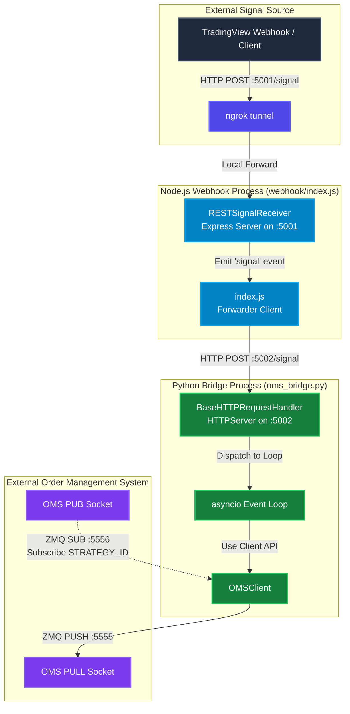
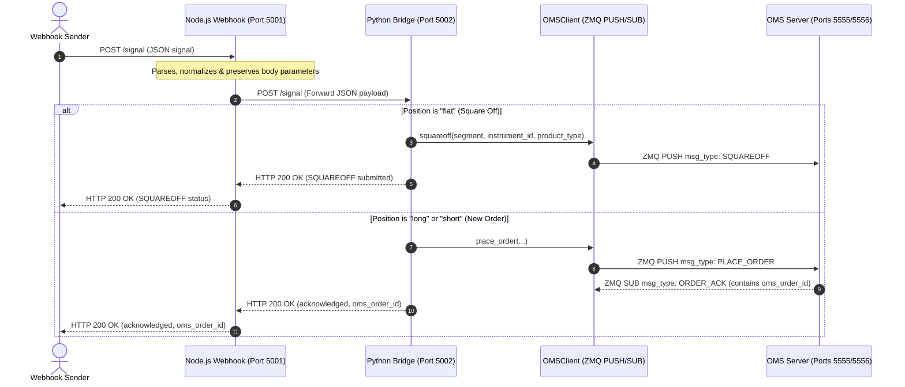

# OMS Webhook Integration System

This repository provides a complete, end-to-end asynchronous signal-to-order execution framework. It integrates a **Node.js Webhook Receiver** (exposed via ngrok) with a **ZeroMQ-based Order Management System (OMS)** using a lightweight, native **Python HTTP Bridge**.

---

## Table of Contents
1. [System Architecture](#system-architecture)
2. [Flowcharts & Diagrams](#flowcharts--diagrams)
   - [System Architecture Topology](#system-architecture-topology)
   - [Order Execution Sequence Diagram](#order-execution-sequence-diagram)
3. [Component Breakdown](#component-breakdown)
   - [1. Node.js Webhook (`webhook/`)](#1-nodejs-webhook-webhook)
   - [2. Python HTTP Bridge (`oms_bridge.py`)](#2-python-http-bridge-oms_bridgepy)
   - [3. Nifty Signal Bridge (`nifty_signal_bridge.py`)](#3-nifty-signal-bridge-nifty_signal_bridgepy)
   - [4. Strategy Client (`strategy_client.py`)](#4-strategy-client-strategy_clientpy)
   - [5. Sample Strategy (`sample_strategy.py`)](#5-sample-strategy-sample_strategypy)
4. [ZeroMQ & HTTP Message Formats](#zeromq--http-message-formats)
5. [Getting Started & Configuration](#getting-started--configuration)
   - [Prerequisites](#prerequisites)
   - [Running the Services](#running-the-services)
   - [Verification & Testing](#verification--testing)

---

## System Architecture

The integration system processes incoming REST signals (e.g., from TradingView or an external algorithm) and submits corresponding order requests to a high-speed ZeroMQ-based OMS.

*   **Ingress (Node.js)**: A lightweight Express server in Node.js listens on port `5001` for trade signals. It normalizes parameters, preserves custom properties, and passes them to a forwarding client.
*   **Bridge (Python)**: Since ZeroMQ bindings in Node.js require native C++ compilation (which can be unstable on Windows), a lightweight Python script (`oms_bridge.py`) hosts a local HTTP server on port `5002` using standard libraries.
*   **OMS client (Python)**: The Python bridge uses the `OMSClient` class (built on `pyzmq`) to push orders to the OMS server (`tcp://127.0.0.1:5555`) and subscribe to response updates (`tcp://127.0.0.1:5556`).
*   **Acknowledgment Await**: For order placements, the bridge waits for the downstream `ORDER_ACK` via ZMQ, extracts the broker-assigned `oms_order_id`, and returns it back to the Node.js webhook response in real time.

---

## Flowcharts & Diagrams

### System Architecture Topology

This flowchart illustrates the path of a trade signal from the internet through the webhook, the bridge, and the client, to the OMS:



### Order Execution Sequence Diagram

This sequence diagram details the chronological execution flow, showing how both new orders and square-offs are processed:



---

## Component Breakdown

### 1. Node.js Webhook (`webhook/`)
A lightweight Node.js/Express application that listens on port `5001`.
*   **`RESTSignalReceiver.js`**: Exposes the `/signal` POST route. It extracts and normalizes the core parameters (`action`, `quantity`, `position`, `symbol`, `orderType`, `limitPrice`, `productType`, `instrumentType`) while using `...req.body` to forward all additional vendor-specific parameters intact.
*   **`index.js`**: Hooks into the event emitter from the receiver. When a signal is parsed, it sends an HTTP POST request to the Python bridge at `http://127.0.0.1:5002/signal` using Node's native `http` module (eliminating external library requirements).

### 2. Python HTTP Bridge (`oms_bridge.py`)
A background service written in Python that acts as a translator between Node's HTTP client and the OMS's ZMQ socket:
*   Connects to the ZMQ OMS ports.
*   Spins up a lightweight, standard library `http.server.HTTPServer` on port `5002` in a background thread.
*   Uses `asyncio.run_coroutine_threadsafe` to handle requests asynchronously inside the main event loop.
*   Supports order placement (with a 10s wait for ZMQ acknowledgments) and position square-offs (when `position` is `"flat"`).
*   Applies fallback instrument defaults (e.g. NIFTY) if instrument information is omitted from the webhook.

### 3. Nifty Signal Bridge (`nifty_signal_bridge.py`)
A standalone Python script that automatically resolves NIFTY 25000 CE contracts from the master data CSV and routes trade signals to the OMS:
*   Parses `master_data/NSEFO.csv` on startup and indexes contracts by (Name, StrikePrice, OptionType) for O(1) lookups.
*   Automatically filters for NIFTY 25000 CE (OptionType=3) contracts with expiry ≥ current date.
*   Supports two expiry selection modes:
  - `nearest` (default): Selects the closest active/upcoming weekly or monthly contract
  - `furthest`: Selects the chronologically furthest expiration date
*   Runs an HTTP server on port `5002` (configurable) with a `/signal` POST endpoint.
*   Integrates with `OMSClient` to send PLACE_ORDER and SQUAREOFF signals using a dummy limit price (default 1.0).
*   Waits for ZMQ `ORDER_ACK` and returns the status and `oms_order_id` in the response.

**Usage**:
```bash
python nifty_signal_bridge.py --port 5002 --expiry-mode nearest
```

**Test Signal**:
```bash
curl -X POST http://localhost:5002/signal \
  -H "Content-Type: application/json" \
  -d '{"action": "BUY", "position": "long", "quantity": 65}'
```

### 4. Strategy Client (`strategy_client.py`)
The underlying client library utilized by Python scripts to:
*   Open ZMQ sockets (`PUSH` to port 5555, `SUB` to port 5556).
*   Filter incoming execution updates by `strategy_id`.
*   Maintain a mapping of pending futures to support async waiting blocks (`wait_for_ack`, `wait_for_open`, `wait_for_terminal`).

### 5. Sample Strategy (`sample_strategy.py`)
A reference implementation showing how a script can programmatically interact with `OMSClient` to execute multi-step logic (e.g. place a limit order, wait for open, modify the limit price, and cancel).

---

## ZeroMQ & HTTP Message Formats

### 1. Ingress Webhook Payload (HTTP POST to Node.js)
```json
{
  "action": "BUY",
  "quantity": 75,
  "position": "long",
  "exchange_segment": "NSEFO",
  "exchange_instrument_id": 41723,
  "instrument_name": "NIFTY2651223400CE",
  "orderType": "LIMIT",
  "limitPrice": 0.5
}
```

### 2. Output Command from Bridge (ZMQ PUSH)
```json
{
  "msg_type": "PLACE_ORDER",
  "strategy_id": "WEBHOOK_BRIDGE",
  "signal_id": "9b1deb4d-3b7d-4bad-9bdd-2b0d7b3d4f82",
  "timestamp": "2026-06-04T12:00:00.123456",
  "exchange_segment": "NSEFO",
  "exchange_instrument_id": 41723,
  "instrument_name": "NIFTY2651223400CE",
  "product_type": "MIS",
  "order_type": "LIMIT",
  "order_side": "BUY",
  "time_in_force": "DAY",
  "order_quantity": 75,
  "limit_price": 0.5,
  "stop_price": 0.0,
  "disclosed_quantity": 0,
  "tags": {}
}
```

### 3. Execution Update from OMS (ZMQ SUB)
```text
WEBHOOK_BRIDGE {"msg_type": "ORDER_ACK", "strategy_id": "WEBHOOK_BRIDGE", "signal_id": "9b1deb4d...", "oms_order_id": "OMS_87654", "status": "PENDING"}
```

---

## Getting Started & Configuration

### Prerequisites
1. **Python 3.8+** with `pyzmq` installed:
   ```bash
   pip install pyzmq
   ```
2. **Node.js v18+** (for Express and native HTTP module).
3. A running **ngrok** instance (configured to port `5001`) to receive external signals from platforms like TradingView.

### Running the Services

1.  **Start your ZMQ OMS Server**:
    Ensure the broker simulator / interactive OMS server is listening on ports `5555` and `5556`.

2.  **Start the Python Bridge**:
    Run the bridge from the `mukul_scripts` root directory:
    ```bash
    .venv\Scripts\python.exe oms_bridge.py
    ```
    *Logs will display connection confirmation: `OMS Client connected. Starting HTTP thread...`*

3.  **Start the Node.js Webhook Service**:
    In another terminal window:
    ```bash
    cd webhook
    node index.js
    ```
    *Console will log: `Webhook service running on port 5001`*

### Verification & Testing

Verify that the end-to-end integration works correctly by triggering a test request:

```bash
curl -X POST http://localhost:5001/signal \
  -H "Content-Type: application/json" \
  -d '{
    "action": "BUY",
    "quantity": 75,
    "position": "long",
    "exchange_segment": "NSEFO",
    "exchange_instrument_id": 41723,
    "instrument_name": "NIFTY2651223400CE",
    "orderType": "LIMIT",
    "limitPrice": 0.5
  }'
```

#### Expected Log Outputs:
*   **Node.js Console**:
    ```text
    Received signal: BUY 75 for NIFTY2651223400CE (Position: long)
    [index.js] Webhook Signal Processed: { ... }
    [index.js] Forward response (Status: 200): {"status": "acknowledged", "oms_order_id": "OMS_12345", "signal_id": "...", "response": { ... }}
    ```
*   **Python Bridge Console**:
    ```text
    Received signal from webhook: Action=BUY, Qty=75, Position=long, Symbol=NIFTY2651223400CE
    Processing order placement for NIFTY2651223400CE ...
    Order signal sent | signal_id=9b1deb4d...
    Waiting for ACK from OMS server (timeout 10s)...
    [OMS Update] type=ORDER_ACK, oms_id=OMS_12345, status=PENDING
    Order acknowledged by OMS | oms_order_id=OMS_12345
    ```
