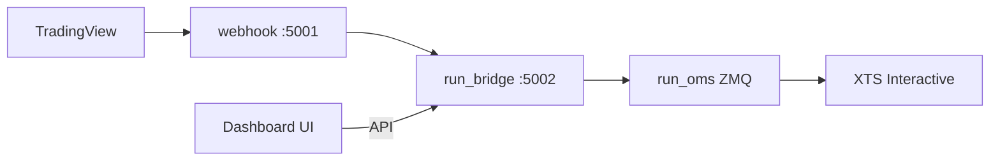

# Trading Middleware

End-to-end async signal → order pipeline: **Node webhook + dashboard**, **Python signal bridge**, and a **ZeroMQ OMS** with an XTS broker adapter.

## Docs

| Doc | Contents |
|-----|----------|
| [docs/architecture.md](docs/architecture.md) | Topology, patterns, process map |
| [docs/oms.md](docs/oms.md) | OMS package & lifecycle |
| [docs/bridge.md](docs/bridge.md) | Bridge HTTP API & resolution |
| [docs/webhook.md](docs/webhook.md) | Node webhook & dashboard |
| [docs/configuration.md](docs/configuration.md) | `.env`, `config.yaml`, launch |
| [docs/message-formats.md](docs/message-formats.md) | HTTP / ZMQ / JSON schemas |
| [webhook/README.md](webhook/README.md) | Webhook quick start |

## Quick start

1. Copy `.env.example` → `.env` and fill XTS credentials.
2. Install Python deps (`pip install -r requirements.txt`) and `cd webhook && npm install`.
3. Launch (Windows): `script.bat` — or manually:

```bash
python run_oms.py
python run_bridge.py --port 5002
cd webhook && npm start
```

- Dashboard: http://localhost:5001  
- Bridge API: http://localhost:5002  
- OMS ZMQ: `tcp://127.0.0.1:5555` (PUSH) / `5556` (SUB)

## Architecture (summary)



**Note:** The dashboard is served by Node on `:5001`, but its position/history/alert/order calls go **directly to the Python bridge** on `:5002`.

## Entry points

| Role | Command |
|------|---------|
| OMS | `python run_oms.py` |
| Bridge | `python run_bridge.py` |
| Webhook | `node webhook/server.js` |
| Master CSVs | `python -m market_data.download_masters` |
| ATM smoke | `python -m market_data.atm` |

## Tests

```bash
python -m pytest -q
```

Characterization suite covers bridge resolution/display and OMS place/cancel/modify/fill flows via a `FakeBroker`.

## Verification curl

```bash
curl -X POST http://localhost:5001/signal \
  -H "Content-Type: application/json" \
  -d "{\"action\":\"BUY\",\"position\":\"long\",\"quantity\":75,\"ticker\":\"NIFTY260630C27000\"}"
```
