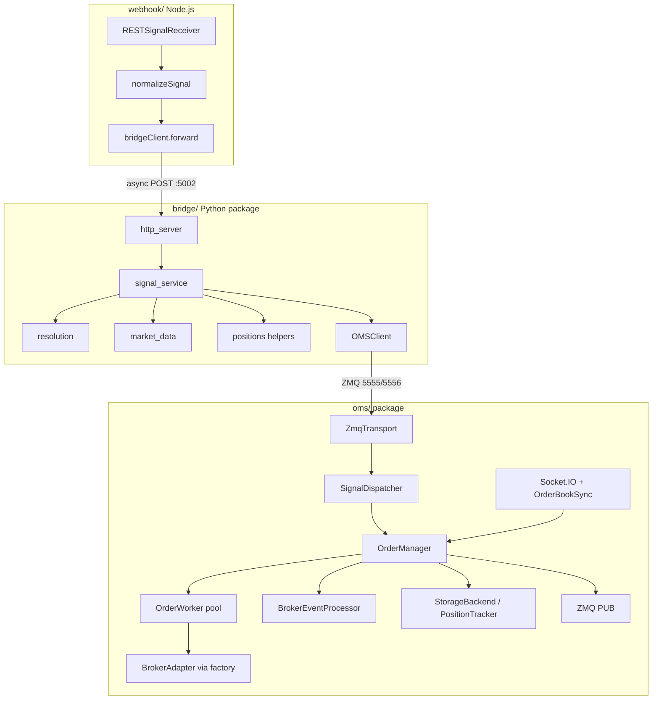
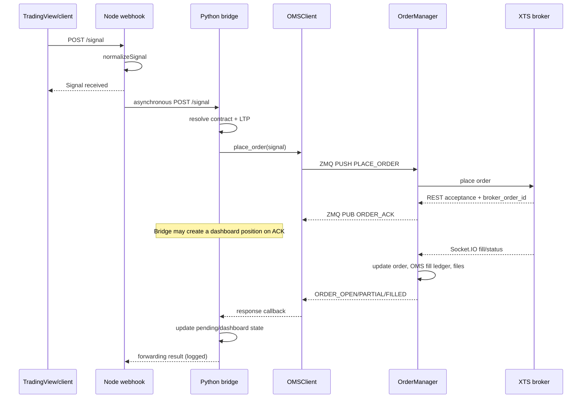

# System Architecture



## Process topology

| Process | Entry | Port / sockets |
|---------|-------|----------------|
| OMS | `python run_oms.py` | ZMQ PULL `5555`, PUB `5556` |
| Bridge | `python run_bridge.py` | HTTP `5002` |
| Webhook + dashboard | `node webhook/server.js` | HTTP `5001` |

Each process can be restarted independently, but they communicate through
in-memory sockets and local files rather than a durable message broker. The
recommended startup order is OMS → bridge → webhook.

## Component responsibilities

- **Webhook** validates and normalizes public signal input, forwards it to the
  bridge, stores a bounded signal history, and serves static dashboard files.
- **Bridge** resolves contracts, obtains market prices, translates user intent
  into OMS commands, tracks pending signals, and serves dashboard APIs.
- **OMS** owns broker-bound order execution, order lifecycle state, position
  accounting, reconciliation, and durable execution logs.
- **Broker adapter** translates the internal broker contract to XTS REST and
  Socket.IO protocols.
- **Market-data package** provides quotes, master contracts, and ATM contract
  discovery independently of interactive order execution.

## Order data flow



The webhook response only means Node accepted and normalized the signal; it
does not wait for bridge forwarding. A direct bridge response means the signal
was processed or queued by the bridge, not necessarily filled by the broker.
Consumers should correlate later state with `signal_id` when available.

## State ownership and durability

There are two separate position models:

| Store | Owner | Keying | Meaning |
|-------|-------|--------|---------|
| Bridge `positions.json` | bridge dashboard | exchange instrument ID | Workflow/display state; a record can appear after `ORDER_ACK`, before a fill |
| OMS `data/positions.json` | OMS `PositionTracker` | segment + instrument + product | Fill-derived ledger used for execution accounting |

```text
webhook/signals.json       normalized ingress history
positions/history/alerts   bridge dashboard and signal state
data/*                     authoritative local OMS execution snapshots/logs
broker                     external source of truth after uncertain failures
```

There is no transaction spanning these stores. Socket events and polling may
observe the same broker transition, so event processing must remain
idempotent. On restart or after connectivity loss, reconcile local state with
the broker order book.

Bridge pending-order maps and ATM cache live only in memory and are lost on
restart. ZMQ PUB/SUB is not durable; subscribers can miss updates while
disconnected.

## Concurrency model

- Node handles webhook and static-file requests through the JavaScript event
  loop.
- The bridge owns an asyncio loop for OMS communication and starts the HTTP
  server and cleanup worker in daemon threads.
- The OMS receives ZMQ messages on asyncio sockets and uses a bounded queue
  with configurable worker concurrency.
- Broker Socket.IO events provide low-latency updates; `OrderBookSync` polls
  concurrently as a reconciliation path.
- File persistence uses thread offloading so blocking disk I/O does not stall
  the OMS event loop.

## Failure boundaries

- **Webhook unavailable:** direct bridge requests can still operate.
- **Bridge unavailable:** webhook forwarding and dashboard API calls fail, but
  the OMS can continue processing already-received orders.
- **OMS unavailable:** the bridge may accept HTTP input but cannot receive a
  successful OMS acknowledgement.
- **Socket feed unavailable:** polling can recover broker status at a higher
  latency.
- **Broker login unavailable:** OMS starts in degraded mode for diagnostics,
  but broker operations fail.
- **Market data unavailable:** contract pricing and ATM fallback can prevent
  bridge startup or signal resolution.

## Design patterns used

- **Facade** — `OrderManager` orchestrates transport, dispatcher, workers, and sync
- **Adapter** — `AbstractBrokerAdapter` / `XTSBrokerAdapter`
- **Factory** — `oms.broker.factory.create_broker`
- **Command** — `SignalDispatcher` (`msg_type` → handler)
- **Producer / consumer** — order queue + `OrderWorker` pool
- **Repository** — `StorageBackend` / `FileStore`, plus `bridge.positions`
  helpers for dashboard JSON
- **Strategy** — multi-mode contract resolution in `bridge/resolution.py`

See [design-patterns.md](design-patterns.md) for participants, trade-offs,
extension recipes, domain transitions, and dependency rules.

## Extension points

- Add a broker by implementing `AbstractBrokerAdapter` and registering it in
  the broker factory.
- Replace filesystem persistence by implementing `StorageBackend` and wiring
  it in `run_oms.py` (startup currently constructs `FileStore` directly).
- Add OMS commands by registering handlers on `SignalDispatcher` inside
  `OrderManager`.
- Add contract-resolution behavior behind the common normalized contract
  shape.
- Add webhook sources by subclassing `SignalSource` and emitting normalized
  signal events. `OMSClient.on_response` currently supports a single
  replaceable callback.

## Important correction

The dashboard UI is served by the **Node** process on `:5001`, but position / alert / history / square-off API calls go **directly to the Python bridge** on `:5002` (configured via `BRIDGE_API_BASE` / `runtime-config.js`). They do not route through Node.
