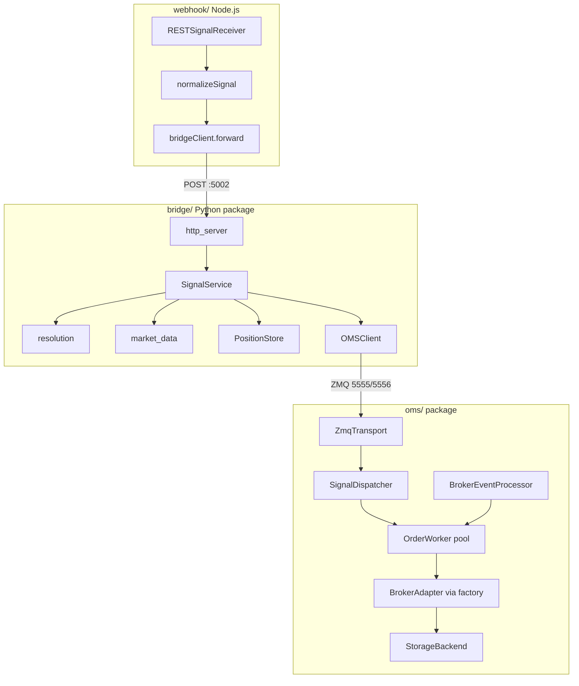

# System Architecture

## Process topology

| Process | Entry | Port / sockets |
|---------|-------|----------------|
| OMS | `python run_oms.py` | ZMQ PULL `5555`, PUB `5556` |
| Bridge | `python run_bridge.py` | HTTP `5002` |
| Webhook + dashboard | `node webhook/server.js` | HTTP `5001` |

## Design patterns used

- **Facade** — `OrderManager` orchestrates transport, dispatcher, workers, and sync
- **Adapter** — `AbstractBrokerAdapter` / `XTSBrokerAdapter`
- **Factory** — `oms.broker.factory.create_broker`
- **Command** — `SignalDispatcher` (`msg_type` → handler)
- **Producer / consumer** — order queue + `OrderWorker` pool
- **Repository** — `StorageBackend`, bridge position/history/alert JSON store
- **Strategy** — multi-mode contract resolution in `bridge/resolution.py`

## Important correction

The dashboard UI is served by the **Node** process on `:5001`, but position / alert / history / square-off API calls go **directly to the Python bridge** on `:5002` (configured via `BRIDGE_API_BASE` / `runtime-config.js`). They do not route through Node.
