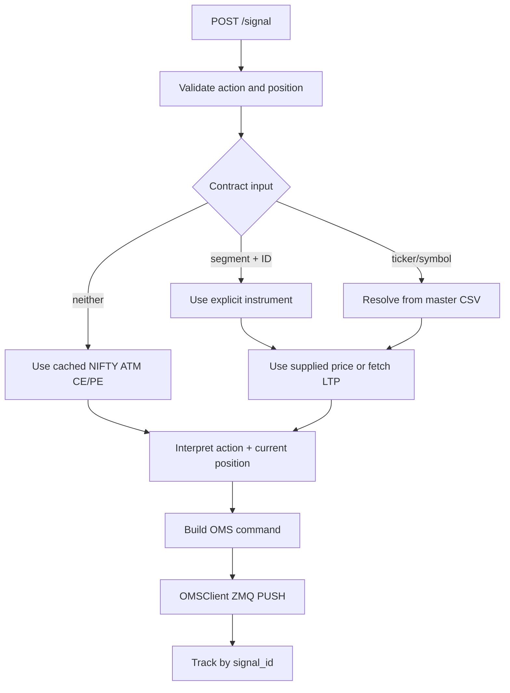

# Signal Bridge

Entry point: `python run_bridge.py --port 5002`.

## Package layout

```
bridge/
  resolution.py     TV ticker → master CSV contract (multi-exchange)
  positions.py      positions.json / history.json / alerts.json
  market_data.py    LTP hydrate for dashboard display
  signal_service.py handle_signal + OMS response tracking
  http_server.py    HTTP routes + JSON/CORS helper
  state.py          process globals (client, loop, atm_data, …)
```

Related packages:

- `clients/oms_client.py` — ZMQ client used by the bridge
- `market_data/` — XTS quotes, `ContractLoader`, ATM helpers, master downloader

## HTTP API (`:5002`)

| Method | Path | Purpose |
|--------|------|---------|
| POST | `/signal` | Place / square-off via action + position |
| GET | `/status?signal_id=` | Pending order status |
| GET | `/positions` | Bridge position/workflow records (+ live LTP) |
| GET | `/alerts` | Recent alerts |
| GET | `/history` | Closed positions |
| POST | `/squareoff` | Manual square-off by `instrument_key` |

## Signal processing



The bridge accepts both camelCase and snake_case aliases for common order
fields. It generates a `signal_id` for correlation, sends an OMS command, and
tracks acknowledgements and later status responses asynchronously.

The HTTP acceptance response is not proof of a broker fill. Query `/status`
and inspect the OMS response stream or dashboard state.

## Resolution order

1. Explicit `exchange_segment` + `exchange_instrument_id`
2. `ticker` / `symbol` via master CSVs (`NSEFO`, `BSEFO`, `MCXFO`, `NSECM`, `BSECM`)
3. Fallback: cached NIFTY ATM CE/PE from `market_data.get_atm_data()`

Explicit IDs are enriched from a matching master row when available. If no
row is found, the supplied instrument name and lot size are used. Ticker
resolution normalizes TradingView option syntax and searches the relevant
master contract data.

## Position intent

The bridge combines `action`, `position`, and current bridge position state to
choose whether to open or close an instrument. Position records are keyed by
exchange instrument ID only.

Important semantics:

- A bridge position record can be created when an `ORDER_ACK` / pending
  acknowledgement arrives, not only after a broker fill.
- Pending or later-rejected workflow records can therefore appear temporarily
  in `/positions`.
- OMS `PositionTracker` maintains a separate fill-derived ledger under
  `data/positions.json` with different keying (segment + instrument + product).
- Manual `/squareoff` issues a reverse `MARKET` order through
  `OMSClient.place_order`; it does not send the OMS `SQUAREOFF` command.

Bridge position files are dashboard/workflow state, not a transactional mirror
of OMS or broker positions. After crashes or missed events, reconcile against
the OMS and broker before assuming the dashboard is authoritative.

## Threading and async boundary

`run_bridge.py` owns the asyncio loop and the `OMSClient`. The standard-library
HTTP server and periodic cleanup run in daemon threads. HTTP handlers schedule
async signal work onto the main loop through the bridge's established
thread-safe path.

Avoid direct blocking market-data or filesystem work on the main loop. Shared
state in `bridge.state` should be mutated through existing orchestration paths
to avoid cross-thread races. Bridge JSON helpers currently perform plain
file reads/writes without locking or atomic replace, so concurrent writers
can race.

## Failure behavior

- Invalid required fields return a JSON error without sending an OMS command.
- Contract lookup or LTP failure returns an error before placement.
- Missing OMS acknowledgement marks the pending signal as timed out; the
  bridge does not automatically cancel the OMS/broker order on that timeout.
- Terminal acknowledgement states (`REJECTED`, `CANCELLED`, `EXPIRED`,
  `ERROR`) mark the request failed.
- Cleanup removes stale pending state and bounds dashboard files.
- Initial ATM fetch during `run_bridge.py` startup is currently required; if
  it fails, the bridge does not become operational.

## Extension points

- Add ticker formats and exchange search rules in `bridge.resolution`.
- Add quote sources behind `bridge.market_data`.
- Add endpoints in `bridge.http_server`, keeping business logic in service
  modules.
- Keep OMS wire details inside `clients.oms_client`.

See [message-formats.md](message-formats.md) for payload examples and
[operations.md](operations.md) for runtime troubleshooting.
