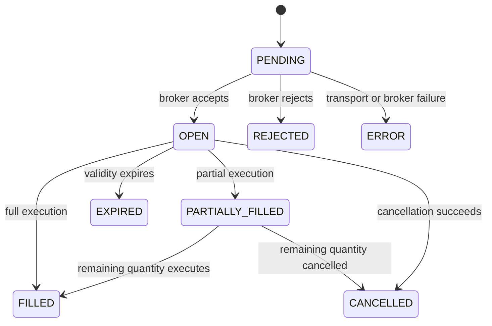

# Design Patterns

This project uses a small set of patterns to isolate broker-specific code,
keep asynchronous order processing manageable, and make business logic
testable. The patterns are practical boundaries rather than framework
abstractions.

## Pattern map

| Pattern | Implementation | Why it is used |
|---------|----------------|----------------|
| Facade | `oms.core.order_manager.OrderManager` | Presents one OMS lifecycle and command surface over several collaborators |
| Adapter | `AbstractBrokerAdapter`, `XTSBrokerAdapter` | Keeps XTS request/response details outside the OMS domain |
| Factory | `oms.broker.factory.create_broker` | Selects a broker implementation from configuration |
| Command registry | `SignalDispatcher` and its registered handlers | Routes `msg_type` values without a central `if/elif` chain |
| Producer/consumer | `ZmqTransport`, the bounded order queue, `OrderWorker` | Separates message intake from broker API latency |
| Repository | `StorageBackend`, `FileStore`, bridge position helpers | Isolates persistence from orchestration |
| Strategy via protocol | `BrokerEventParser`, `StorageBackend` | Allows behavior to be replaced through structural interfaces |
| Domain model | `Order`, `OrderResponse`, `Position`, enums | Centralizes state, validation, and serialization rules |
| Observer/callback | OMS PUB socket, `OMSClient.on_response`, broker socket callbacks | Delivers asynchronous status changes to interested components |
| Cache-aside | Contract loaders and bridge ATM data | Avoids repeatedly loading master files or fetching fallback contracts |

## Facade: `OrderManager`

`OrderManager` is the public orchestration boundary for the OMS. It owns the
order registry and coordinates:

- `ZmqTransport` for inbound commands and outbound strategy responses;
- `SignalDispatcher` for command routing;
- `OrderWorker` instances for broker-bound work;
- `BrokerEventProcessor` for normalized socket and polling events;
- `OrderBookSync` as a safety net for missed real-time events;
- `StorageBackend` and `PositionTracker` for durable state.

Callers should use the facade instead of coordinating these collaborators
directly. This keeps lifecycle actions (`start`, `stop`, restore, dispatch,
publish, persist) in one place while allowing each collaborator to remain
focused.

### Trade-off

The facade still owns substantial order workflow logic. New unrelated
responsibilities should be added as collaborators, not as more state inside
`OrderManager`.

## Adapter: broker isolation

`oms.broker.base.AbstractBrokerAdapter` defines the operations the OMS needs:
login/logout, place, modify, cancel, cancel-all, square-off, and order-book
queries. `XTSBrokerAdapter` translates those operations to XTS API calls and
normalizes broker errors.

The rest of the OMS works with internal order fields and does not depend on
XTS parameter names or response envelopes.

### Adding another broker

1. Implement `AbstractBrokerAdapter`.
2. Normalize broker events into the shape consumed by
   `BrokerEventProcessor`.
3. Add the adapter to `create_broker`.
4. Add a broker-specific configuration section or extend `BrokerConfig`.
5. Run the order-manager contract tests against a fake and the new adapter.

Broker-specific status strings should be mapped at the adapter boundary. Do
not spread broker response parsing through the core package.

## Factory: configuration-driven construction

`create_broker(config)` reads `config.type` and returns an
`AbstractBrokerAdapter`. `run_oms.py` therefore depends on the abstraction,
not `XTSBrokerAdapter`.

The factory currently supports `xts`. Unsupported values fail fast with a
`ValueError`, which makes configuration errors visible during startup.

## Command registry: inbound OMS routing

Every ZMQ command contains a `msg_type`. `SignalDispatcher` maps that value to
an async handler:

```text
PLACE_ORDER  -> place handler
CANCEL_ORDER -> cancel handler
MODIFY_ORDER -> modify handler
SQUAREOFF    -> square-off handler
CANCEL_ALL   -> cancel-all handler
```

Adding a command requires a handler, registration, a request schema, response
types, and tests. Unknown commands are routed to the configured fallback
handler instead of being silently ignored.

The bridge uses a related command-oriented style: `handle_signal` translates
the external `action`/`position` pair into an OMS operation.

## Producer/consumer: bounded asynchronous work

The transport receives signals quickly and places broker-bound operations on
a bounded `asyncio.Queue`. Multiple `OrderWorker` consumers process that
queue concurrently.

This provides:

- backpressure through `oms.max_queue_size`;
- controlled concurrency through `oms.order_workers`;
- isolation between ZMQ intake and broker network latency;
- orderly shutdown through task cancellation and queue lifecycle.

Increasing worker count can improve throughput, but also increases broker API
concurrency and the chance of rate limiting. Tune it together with broker
limits and retry settings.

## Repository and storage strategy

`StorageBackend` is a structural protocol. `FileStore` is the default
implementation and writes:

- active order snapshots;
- append-only order and trade CSV files;
- current positions;
- daily statistics.

Blocking filesystem operations are moved to worker threads with
`asyncio.to_thread`, and JSON snapshots are replaced atomically. Tests can
provide an in-memory implementation without changing `OrderManager`.

The bridge has a smaller repository boundary in `bridge.positions` for
`positions.json`, `history.json`, and `alerts.json`.

### State ownership

OMS files are authoritative for OMS order execution state. Bridge files are
presentation and signal-tracking state for the dashboard. They are related
but are not a single transactional database; operators should not assume an
update to both stores is atomic.

Bridge dashboard positions are keyed only by instrument ID and may be created
on acknowledgement, while OMS positions are fill-derived and keyed by
segment + instrument + product. Treat them as related views, not synonyms.

## Domain models and state transitions

`Order`, `OrderResponse`, and `Position` keep domain state out of raw
dictionaries where possible. String enums constrain order status, side,
type, product, exchange segment, and time-in-force values.

A typical successful order transition is:



Broker events can arrive more than once or out of order. Processing code must
compare cumulative filled quantities and preserve terminal states rather than
assuming exactly-once delivery.

## Observer and callback flow

Status changes cross process boundaries asynchronously:

1. XTS Socket.IO invokes the broker-event callback.
2. The event processor updates OMS state.
3. The OMS publishes a topic-prefixed response on its PUB socket.
4. `OMSClient` receives matching strategy messages.
5. The registered bridge callback updates pending requests and dashboard
   state.

Order-book polling runs in parallel as reconciliation for socket disconnects
or missed events. Consumers must therefore tolerate duplicate observations.

## Cache-aside contract resolution

Contract master CSVs are loaded lazily and retained by `ContractLoader`.
Ticker resolution checks the relevant cached masters and the bridge retains
ATM contract data as a fallback. Refresh master data before a trading session
when contracts or expiries may have changed.

## Dependency direction

The intended dependency direction is:

```text
entry points -> orchestration -> protocols/domain -> infrastructure adapters
```

Examples:

- `run_oms.py` constructs dependencies; it does not implement order logic.
- `OrderManager` depends on broker/storage contracts.
- XTS and filesystem details remain in `broker/` and `storage/`.
- HTTP parsing remains in `bridge.http_server`; signal decisions remain in
  `bridge.signal_service`.

Keeping this direction prevents infrastructure details from leaking into
domain workflows and makes the fake-broker test suite useful.
