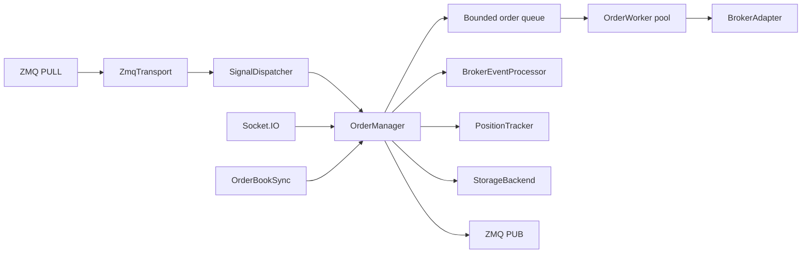

# OMS Package

Entry point: `python run_oms.py`.

## Layout

```
oms/
  broker/     AbstractBrokerAdapter, XTS adapter, Socket.IO, factory
  core/       OrderManager facade, transport, dispatcher, workers, sync, positions
  models/     Order, OrderResponse, enums, XTS_STATUS_MAP
  storage/    StorageBackend protocol + FileStore (async to_thread I/O)
  utils/      env, timeutil, runtime, logger, rate_limiter
  config.py   YAML + ${VAR} env interpolation
```

## Lifecycle

1. Load `config.yaml` (secrets from `.env` via `${XTS_APP_KEY}` etc.)
2. `create_broker(cfg.broker)` → login
3. Optional XTS Socket.IO attach for live fills
4. `OrderManager.start()` binds ZMQ, restores order state, runs workers

Broker login failure does not terminate the process. The OMS starts in
degraded mode so logs and local state remain inspectable, but broker-bound
commands cannot succeed.

## Internal processing pipeline



The queue limits memory growth and decouples signal intake from broker API
latency. `order_workers` controls concurrency; `max_queue_size` controls
backpressure. Broker Socket.IO events and order-book polling enter through
`OrderManager.inject_broker_event`; they do not pass through the worker queue.
The broker adapter itself does not write storage.

## Broker events and reconciliation

XTS Socket.IO is the low-latency path for open, fill, cancellation, rejection,
and other status changes. `OrderBookSync` polls the broker as a safety net:

- every `active_order_sync_interval` seconds while orders are active;
- every `order_sync_interval` seconds otherwise.

Both paths are injected into `OrderManager`, which uses
`BrokerEventProcessor` to normalize fill/status updates before updating
orders, positions, and published responses. Since the same transition may be
observed twice, fill accounting uses cumulative quantities and must remain
idempotent.

## Persistence

`FileStore` implements `StorageBackend` and moves blocking disk work to
threads. JSON snapshots are written atomically; order/trade CSVs are
append-only.

| File | Purpose |
|------|---------|
| `orders_state.json` | active and recent order snapshot restored at startup |
| `positions.json` | current OMS position snapshot |
| `orders_log_<date>.csv` | order lifecycle event audit |
| `trades_<date>.csv` | execution/fill audit |
| `statistics_<date>.json` | daily counters and statistics |

The broker remains the external source of truth after crashes or ambiguous
network failures. Restored local state should be reconciled before new
operator action.

## Error and retry behavior

- Order-placement failures are retried according to `retry_attempts` and
  `retry_delay_ms` (total attempts = `retry_attempts + 1`).
- Cancel, modify, square-off, and cancel-all do not use that same general
  retry loop.
- Modify requests are serialized per order and coalesce latest values; a
  failed modify publishes `MODIFY_REJECTED` while leaving the live order
  unchanged.
- Unknown command types produce a controlled error path through the dispatcher.
- Broker login failure starts the service in degraded mode; there is no
  automatic later re-login loop.
- Socket feed failure falls back to order-book polling.
- Failures are published to the originating `strategy_id` where a response
  can be formed.
- Storage write failures and some publish failures are logged; there is no
  dead-letter / replay queue.

Retries are safest for read operations. For mutating broker calls, code must
account for a request that succeeded remotely but whose response was lost.
Always reconcile using broker order IDs before blindly repeating an action.

## Message types (ingress)

`PLACE_ORDER`, `CANCEL_ORDER`, `MODIFY_ORDER`, `SQUAREOFF`, `CANCEL_ALL`

## Message types (egress, topic = strategy_id)

`ORDER_ACK`, `ORDER_OPEN`, `ORDER_PARTIAL`, `ORDER_FILLED`, `ORDER_CANCELLED`,
`ORDER_REJECTED`, `ORDER_MODIFIED`, `ORDER_EXPIRED`, `ORDER_ERROR`,
`CANCEL_ACK`, `MODIFY_ACK`, `MODIFY_REJECTED`, `SQUAREOFF_ACK`

See [message-formats.md](message-formats.md) for payloads.

## Extension rules

- New broker integrations implement `AbstractBrokerAdapter`; XTS fields must
  not leak into core workflows.
- New commands register with `SignalDispatcher` and define request/response
  contracts and tests.
- New storage backends implement `StorageBackend` and must also be wired in
  `run_oms.py` (startup currently constructs `FileStore`).
- New response states should be added to the domain enums and documented
  before being published.

See [design-patterns.md](design-patterns.md) for pattern details and
[operations.md](operations.md) for health checks and recovery.
