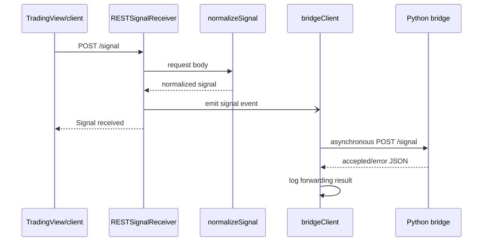

# Webhook & Dashboard

Entry point: `node webhook/server.js`.

## Layout

```
webhook/
  server.js                 Process entry
  RESTSignalReceiver.js     Express /signal route
  normalizeSignal.js        Shared validation / normalization
  bridgeClient.js           fetch-based forwarder to Python bridge
  SignalSource.js           Abstract base
  public/
    index.html              Dashboard shell
    styles.css
    app.js
  .env.example
```

## Env vars

| Variable | Default | Meaning |
|----------|---------|---------|
| `SIGNAL_PORT` | `5001` | Webhook + dashboard listen port |
| `BRIDGE_HOST` | `127.0.0.1` | Python bridge host |
| `BRIDGE_PORT` / `OMS_BRIDGE_PORT` | `5002` | Python bridge port |
| `BRIDGE_API_BASE` | `http://host:port` | Browser-side API base (served as `/runtime-config.js`) |

## Signal path

1. `POST /signal` → `normalizeSignal`
2. Emit `signal` event → asynchronous `bridgeClient.forward` → Python
   `POST :5002/signal`
3. Persist to `signals.json` (capped at 1000 entries)

The HTTP route returns `{"status":"Signal received"}` without waiting for the
bridge response. Forwarding success or failure is logged by `server.js`.

`normalizeSignal` is the public input boundary. It standardizes aliases and
validation before forwarding so downstream code receives a consistent shape.
`bridgeClient` owns bridge URL construction, HTTP forwarding, and transport
errors.

## Runtime flow



Node is an ingress and presentation layer; it does not own order execution or
position accounting.

## Dashboard

Served at `http://localhost:5001/`. Position/history/alert/order calls hit the
Python bridge directly (not proxied through Node).

At startup, Node serves `/runtime-config.js` so browser code can discover
`BRIDGE_API_BASE`. If the dashboard is opened from another machine,
`127.0.0.1` points to that machine, so configure a reachable bridge hostname.

## Persistence

Normalized signals are written to `webhook/signals.json`, newest activity
bounded to 1000 records. This file is for operational visibility, not a
durable order audit. OMS CSV logs and broker records are the appropriate
execution audit sources.

## Error handling

- malformed input is rejected before bridge forwarding;
- bridge network and non-success HTTP responses are logged asynchronously
  after the webhook has acknowledged receipt;
- dashboard API errors are displayed client-side and should be diagnosed
  against `BRIDGE_API_BASE`;
- a successful webhook response does not imply a broker fill.

## Security

The receiver has no built-in authentication or signature verification. If it
is exposed publicly:

- place it behind an authenticated reverse proxy or IP allowlist;
- validate TradingView/shared-secret fields before accepting signals;
- rate-limit requests;
- terminate TLS at the proxy or tunnel;
- do not expose the bridge or OMS sockets directly to the internet.

See [operations.md](../docs/operations.md) for deployment checks and incident
recovery.
